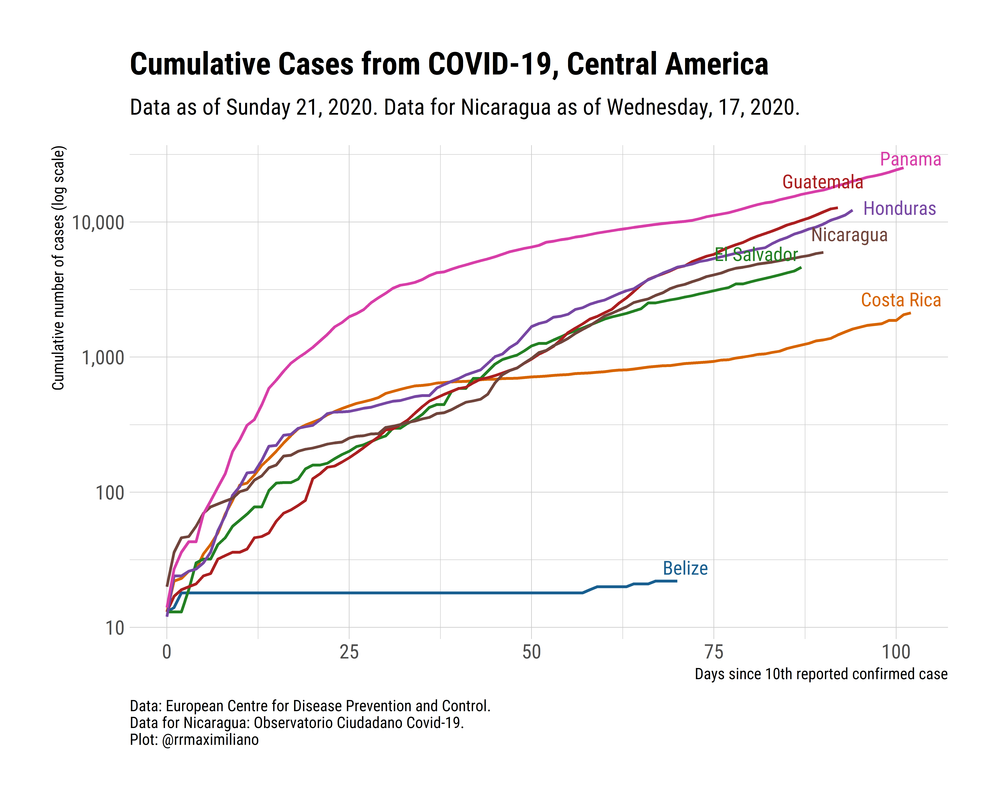
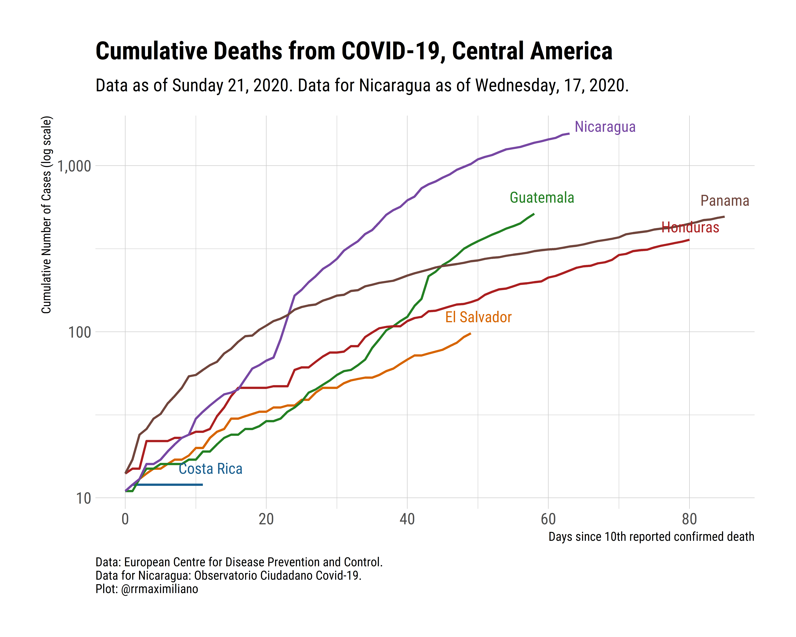

<!-- README.md is generated from README.Rmd. Please edit that file -->

```{r, include = FALSE}
knitr::opts_chunk$set(
  collapse = TRUE,
  comment = "#>",
  fig.path = "man/figures/README-",
  out.width = "100%"
)
```

# Base de datos Observatorio Ciudadano COVID-19 Nicaragua

Este repositorio contiene datos extraídos de los reportes del [Observatorio Ciudadano COVID-19 Nicaragaua](https://observatorioni.org). Lamentablemente, en la página web del observatorio no se encuentra un archivo de descargable de sus datos. 

## Información en la base de datos

Actualmente, los datos en este repositorio contienen información del 18 de marzo al 27 de mayo (último día disponible). Los casos presentados incluyen información proporcionada por el Ministerio de Salud de Nicaragua (MINSA). En caso de requerir información única sobre los casos del MINSA, sugiero utilizar la información de la [European Centre for Disease Prevention and Control](https://www.ecdc.europa.eu/). De igual forma pueden usar el paquete [covdata](https://kjhealy.github.io/covdata/) en R, el cual contiene información de número de casos y muertes oficiales.

## Variables

Las siguientes variables se encuentran en este base de datos: 

* `date`: Fecha.
* `cases`: Acumulado de casos sospechosos COVID-19 reportados por el Observatorio Ciudadano.
* `deaths`: Acumulado de muertes sospechosas COVID-19 reportados por el Observatorio Ciudadano.
* `cases_minsa`: Acumulado de casos COVID-19 reportados por el MINSA.
* `deaths_minsa`: Acumulado de muertes COVID-19 reportados por el MINSA.

## Descargar los datos

Los datos se encuentran en la carpeta `/data` en formato [CSV](https://raw.githubusercontent.com/RRMaximiliano/observatorio-covid-nicaragua/master/data/observatorio_cases.csv). Al acceder el link, deberán darle click derecho "guardar como / save as".

## Curva de contagio y muertes sospechosas por Covid 19





## Caveats

* Los datos presentados por el Observatorio Ciudadano no representan los datos oficiales de Nicaragua. Su función es informar con mayor rigurosidad la presencia de COVID-19 dada la limitaciones de los datos del MINSA. 
* En este repositorio podrán encontrar dos branches: (1) `master` y (2) `old-data`. El segundo branch tiene como objetivo servir como historial de las diferencias en los datos presentados por el Observatorio Ciudadano. A partir del 5 de mayo, los datos en el último informe y en la página web del Observatorio cambiaron retrospectivamente. Otras discrepancias son: 
  * PDF: 4217; Página web: 4117 en el día 30 de Mayo.
  * PDF: 3725; Página web: 3735 en el día 27 de Mayo. 
  * PDF: 2676; Página web: 2702 en el día 23 de Mayo.  
* A partir del informe con fecha 10 de Junio, el Observatorio ha cambiado su metodología de recopilación de datos. El repositorio actual contiene estas modificaciones. Para mayor información sobre su metodología, puede visitar la página web del Observatorio.  
 

## Comentarios y sugerencias

Para realizar comentarios o sugerencias sobre la base de datos puedes abrir un issue en este repositorio: [https://github.com/rrmaximiliano/observatorio-covid-nicaragua/issues](https://github.com/rrmaximiliano/observatorio-covid-nicaragua/issues)
